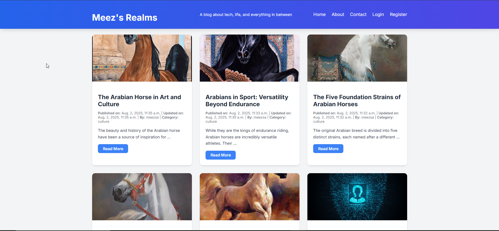
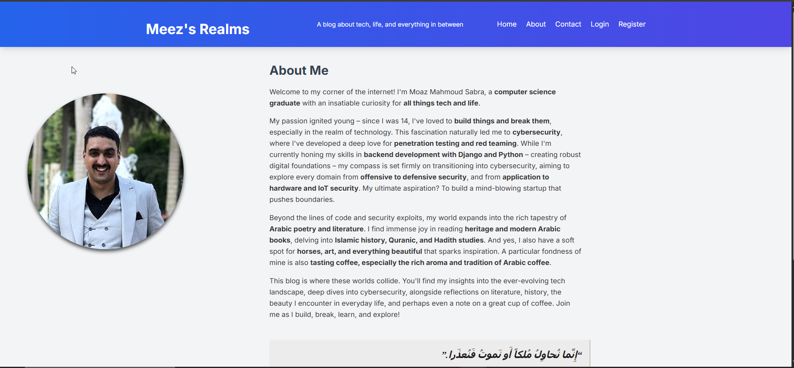
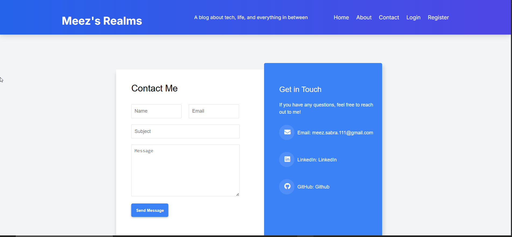
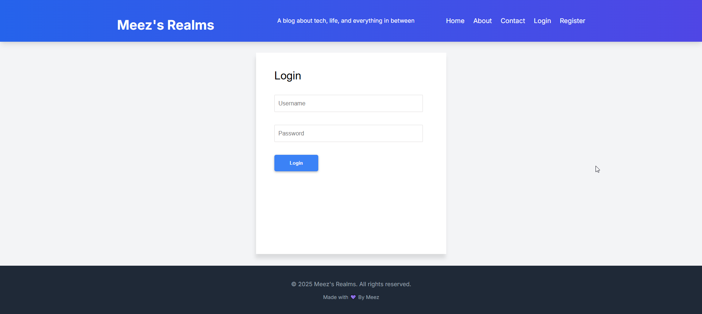
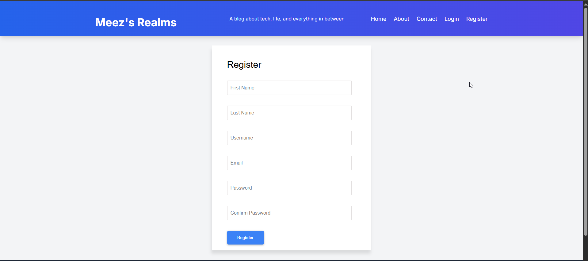
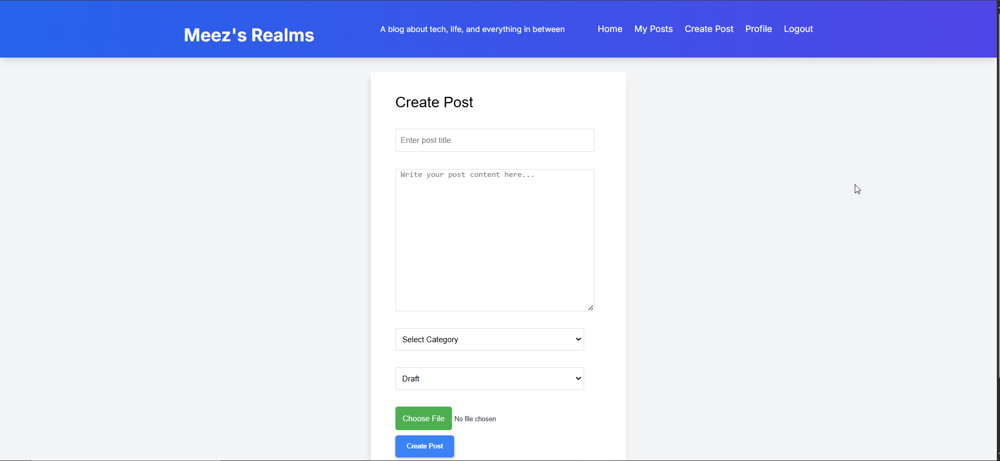
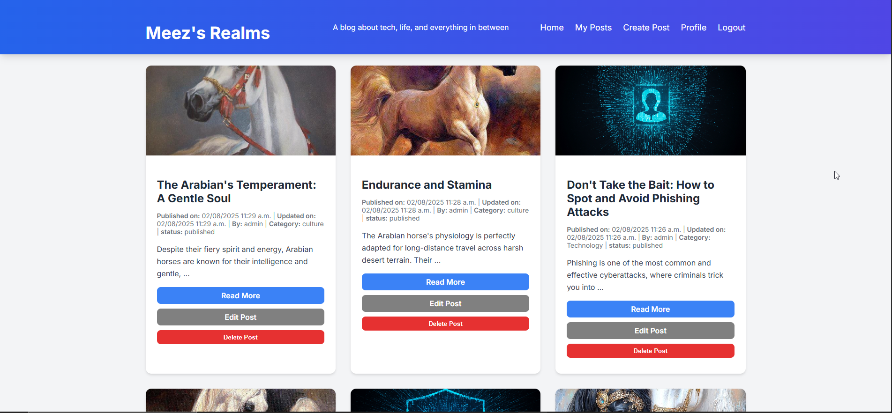
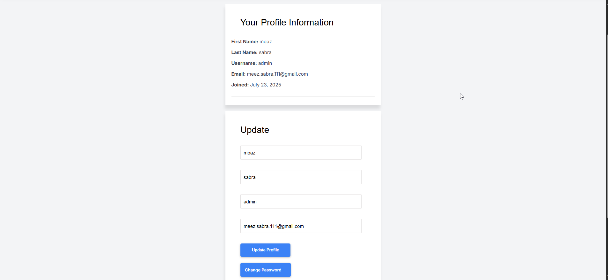

# PyBlog: A Full-Stack Blog Application

**Live Demo on Render:** [Pyblog ](https://pyblog-tooa.onrender.com/)

## Project Overview

PyBlog is a complete, feature-rich blog application built on the Django web framework. This project demonstrates proficiency in full-stack web development, covering everything from user authentication and database management to static file handling and secure deployment. It serves as a personal portfolio piece showcasing a comprehensive understanding of modern web development principles and best practices.

## Key Features

* **User Authentication & Authorization:** Secure user registration, login, and logout. Users can only create, edit, or delete their own posts.
* **Post Management (CRUD):** A complete system for creating, reading, updating, and deleting blog posts.
* **Image Uploads:** Users can upload images directly to accompany their posts, demonstrating file handling and storage.
* **Persistent File Storage:** Implemented a solution to ensure user-uploaded images are not lost on server restarts or redeployments.
* **Production-Ready Static File Handling:** Implements `WhiteNoise` to efficiently serve static assets (CSS, JavaScript) in a production environment.
* **Dynamic Database:** Utilizes PostgreSQL for robust data management, handling posts, users, and other data relationships.
* **Contact Form:** A functional contact page allows visitors to send messages to the site administrator.

## Technology Stack

### Backend
* **Python:** The core programming language.
* **Django:** The high-level Python web framework used to build the application.
* **Gunicorn:** A Python WSGI HTTP server used to run the application in production.
* **PostgreSQL:** The relational database used for data persistence.

### Frontend
* **HTML5 & CSS3:** For structuring and styling the web pages.
* **JavaScript:** For interactive elements.

### Deployment & Tools
* **Render:** The cloud platform used for continuous deployment of the application.
* **dj-database-url:** A utility for easily configuring the database from a single `DATABASE_URL` environment variable.
* **WhiteNoise:** A library to handle the serving of static files from the Django app in production.
* **Git:** For version control.

## Installation and Local Setup

To run this project on your local machine, follow these steps.

1.  **Clone the Repository:**
    ```bash
    git clone [https://github.com/meez-111/pyblog.git](https://github.com/meez-111/pyblog.git)
    cd pyblog
    ```

2.  **Create and Activate a Virtual Environment:**
    ```bash
    python -m venv venv
    source venv/bin/activate
    ```

3.  **Install Dependencies:**
    ```bash
    pip install -r requirements.txt
    ```

4.  **Database Migrations:**
    ```bash
    python manage.py makemigrations
    python manage.py migrate
    ```

5.  **Create a Superuser (Optional):**
    To access the Django admin panel, create a superuser account.
    ```bash
    python manage.py createsuperuser
    ```

6.  **Run the Development Server:**
    ```bash
    python manage.py runserver
    ```
    The application will be available at `http://127.0.0.1:8000/`.

## File Storage

In a production environment, user-uploaded files are lost on every server restart. To solve this problem use a **Render Persistent Disk**. This volume is mounted to the server, providing a durable location for media files that persists across deployments. This demonstrates an understanding of stateless services and the need for persistent storage in a production environment.

## Deployment

This project is deployed on **Render** and uses a PostgreSQL database.

* **Build Command:** `pip install -r requirements.txt && python manage.py collectstatic --no-input`
* **Start Command:** `gunicorn pyblog.wsgi`

Secure environment variables are used for the `SECRET_KEY`, `DATABASE_URL`, and other sensitive settings.

## Screenshots


### Home Page


### About Page



### Contact Me Page



### User Login Page


### User Register Page


### Create Post Page


### User's posts Page


### User Profile Page


## Author

* **LinkedIn** - [My LinkdIn](https://www.linkedin.com/in/moaz-sabra-3a7565330/)
* **Email**: [My Email](meez.sabra.111@gmail.com)


## Author

* **Moaz Sabra** - [meez-111](https://github.com/meez-111)
